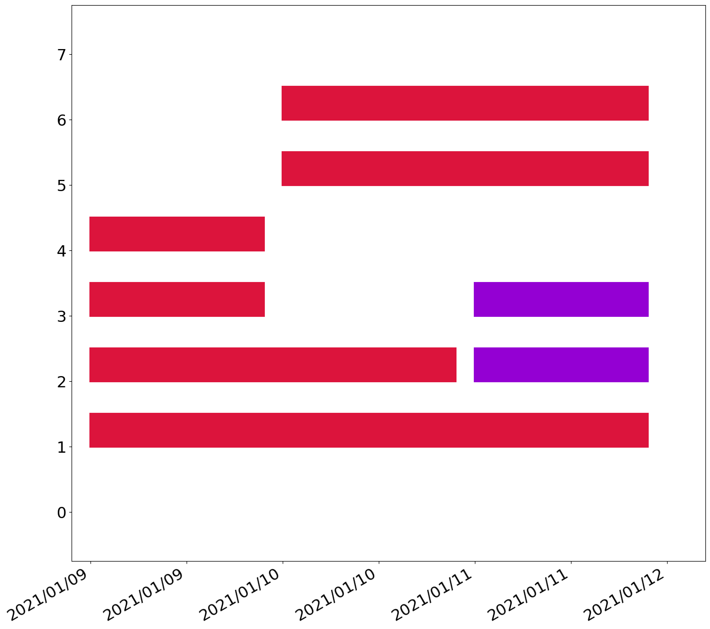

# Objective

Graph blocks of time in a stacked fashion, alternating colors for
blocks that are next to each other.  Input format is a [FSDB]
flat-file streaming database, with an output format of anything that
matplotlib can generate (png, pdf)

[FSDB]: https://www.isi.edu/~johnh/SOFTWARE/FSDB/

# Example Usage

See the [./examples/test.fsdb](example/test.fsdb) for an example
dataset using 'day' size bins (the default).  Running this as follows:

```
python3 timeblocker.py -c begin_time end_time examples/test.fsdb examples/test.png 
```

produces:



# Author

Wes Hardaker <opensource ATAT hardakers.net>

# See also

The [FSDB documentation website](https://fsdb.readthedocs.io/)
